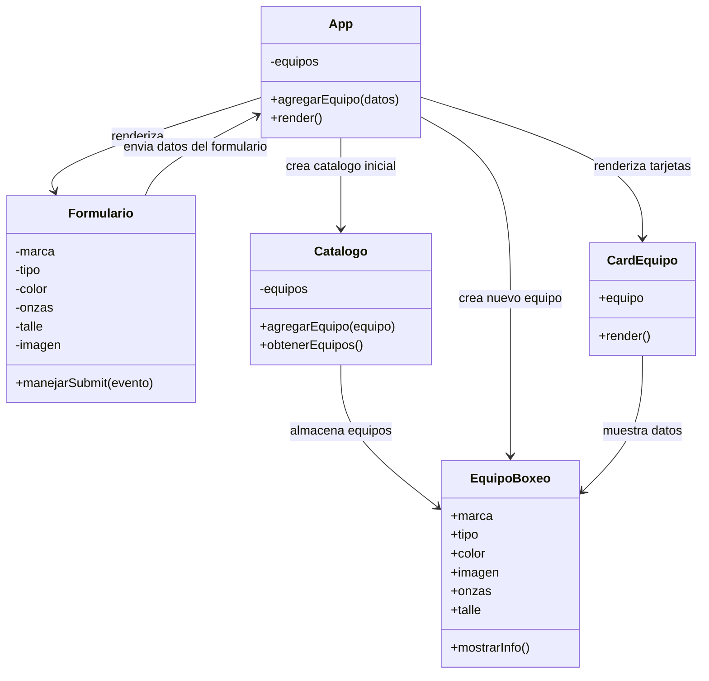

# Trabajo Practico Final

## Catalogo de Equipos de Boxeo

Este proyecto corresponde al trabajo practico final del curso de ingreso con JavaScript. La aplicacion permite administrar un catalogo simple de equipos de boxeo mediante una interfaz desarrollada con React y Vite.

La aplicacion se encuentra desplegada en Vercel:

[Ver aplicacion desplegada](https://catalogo-guantes.vercel.app/)

## Descripcion general

El sistema permite visualizar equipos de boxeo en formato de tarjetas y agregar nuevos elementos al catalogo mediante un formulario. Cada equipo se representa con los siguientes atributos principales:

- Marca.
- Tipo.
- Color.
- Imagen.
- Onzas, para guantes.
- Talle, para cascos.

Actualmente, los datos se manejan en memoria durante la ejecucion de la aplicacion. Al recargar la pagina, se vuelve al catalogo inicial definido en el codigo.

## Diagrama UML

El siguiente diagrama representa la estructura actual de la aplicacion. Los productos se administran mediante clases del modelo y estado de React.



## Descripcion de clases y componentes

- `App`: componente principal de la aplicacion. Crea el catalogo inicial, administra el estado de los equipos y renderiza el formulario junto con las tarjetas.
- `Formulario`: componente encargado de iniciar la carga de un nuevo producto, permitir la seleccion entre guante o casco y mostrar los campos correspondientes.
- `CardEquipo`: componente encargado de mostrar la informacion de cada equipo en una tarjeta.
- `Catalogo`: clase que administra una coleccion de equipos.
- `EquipoBoxeo`: clase que representa un producto del catalogo con marca, tipo, color, imagen y un atributo especifico segun el tipo de producto.

## Flujo principal de la aplicacion

1. `App` crea una instancia de `Catalogo`.
2. `Catalogo` recibe objetos de tipo `EquipoBoxeo` como datos iniciales.
3. `App` guarda los equipos en el estado `equipos`.
4. `Formulario` permite elegir si se desea cargar un guante o un casco.
5. `App` crea un nuevo objeto `EquipoBoxeo` con los datos recibidos.
6. `CardEquipo` muestra cada equipo disponible en el catalogo.

## Requerimientos funcionales

- El usuario debe poder acceder a la aplicacion desde un navegador web.
- El sistema debe mostrar un catalogo inicial de equipos de boxeo.
- El usuario debe poder agregar nuevos equipos al catalogo.
- El sistema debe mostrar cada equipo en una tarjeta individual.
- Cada tarjeta debe mostrar la marca, el tipo, el color, la imagen y el atributo correspondiente: onzas para guantes o talle para cascos.
- El formulario debe validar que los campos requeridos esten completos antes de agregar un equipo.

## Requerimientos no funcionales

- La aplicacion debe estar desarrollada con JavaScript, React y Vite.
- La interfaz debe ser clara, simple e intuitiva.
- El sistema debe responder rapidamente a las acciones del usuario.
- El codigo debe estar organizado en componentes y clases.
- La aplicacion debe poder desplegarse en Vercel.
- La estructura del proyecto debe facilitar el mantenimiento y la incorporacion de futuras mejoras.

## Planificacion de pruebas

Se planificaron pruebas orientadas a verificar el funcionamiento de los componentes principales, la integracion entre ellos y el comportamiento visible para el usuario.

### Pruebas de componentes

Componentes y clases a probar:

- `Formulario`.
- `CardEquipo`.
- `App`.
- `EquipoBoxeo`.
- `Catalogo`.

### Prueba de integracion

Se verifica que el formulario se conecte correctamente con el catalogo. Al completar los datos y presionar el boton `Agregar`, debe aparecer una nueva tarjeta con la informacion ingresada.

### Prueba de caja negra

Se prueba la aplicacion desde la perspectiva del usuario, sin analizar el codigo interno:

- Cargar datos validos.
- Intentar enviar el formulario con campos vacios.
- Ingresar distintos tipos de equipos.
- Verificar que las tarjetas se muestren correctamente.

### Prueba de rendimiento

Se verifica que la aplicacion responda de forma rapida al agregar nuevos equipos y que el proyecto pueda compilarse correctamente.

### Prueba de interfaz

Se revisa que los textos sean legibles, que el formulario sea claro y que las tarjetas presenten la informacion de manera ordenada.

### Prueba de camino

Flujo a validar:

1. Abrir la aplicacion.
2. Completar el formulario.
3. Agregar un equipo.
4. Verificar el resultado en pantalla.

## Ejecucion de pruebas

El archivo utilizado para ejecutar pruebas sobre las clases del modelo es:

```text
tests\pruebas-clases.js
```

Comando para ejecutar las pruebas:

```bash
node tests\pruebas-clases.js
```

Las pruebas utilizan `console.assert`, que permite validar condiciones logicas. Si una condicion no se cumple, se muestra un mensaje de error asociado. En este caso, se verifica que los atributos de `EquipoBoxeo` se guarden con el tipo de dato esperado y que `Catalogo` administre correctamente la lista de equipos.

## Resultado esperado en consola

```text
Aprobada: guantes guarda la marca como string
Aprobada: EquipoBoxeo guarda la ruta imagen como string
Aprobada: guantes guarda el tipo como string
Aprobada: guantes guarda el color como string
Aprobada: guantes guarda las onzas como numero entero
Aprobada: casco guarda el talle como string
Aprobada: casco guarda la marca como string
Aprobada: casco guarda el tipo como string
Aprobada: casco guarda el color como string
Aprobada: casco guarda la ruta imagen como string
Aprobada: casco guarda el talle imagen como string
Aprobada: Catalogo inicia sin equipos
Aprobada: Catalogo agrega un equipo
Aprobada: Catalogo devuelve el equipo agregado
Fin de pruebas

```
## Resultado con errores en consola
Assertion failed: Fallo: guantes guarda la marca como string
Assertion failed: Fallo: EquipoBoxeo guarda la ruta imagen como string
Assertion failed: Fallo: guantes guarda el tipo como string
Assertion failed: Fallo: guantes guarda el color como string
Assertion failed: Fallo: guantes guarda las onzas como numero entero
Aprobada: casco guarda el talle como string
Aprobada: casco guarda la marca como string
Aprobada: casco guarda el tipo como string
Aprobada: casco guarda el color como string
Aprobada: casco guarda la ruta imagen como string
Aprobada: casco guarda el talle imagen como string
Aprobada: Catalogo inicia sin equipos
Aprobada: Catalogo agrega un equipo
Aprobada: Catalogo devuelve el equipo agregado
Fin de pruebas

## Conclusion

La aplicacion cumple con el objetivo principal del proyecto: representar un catalogo de equipos de boxeo, permitir la carga de nuevos elementos y organizar la logica mediante componentes de React y clases de JavaScript. Las pruebas definidas permiten validar el comportamiento basico del sistema y documentar su correcto funcionamiento.
